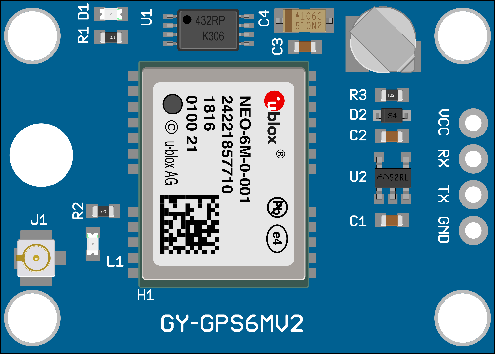
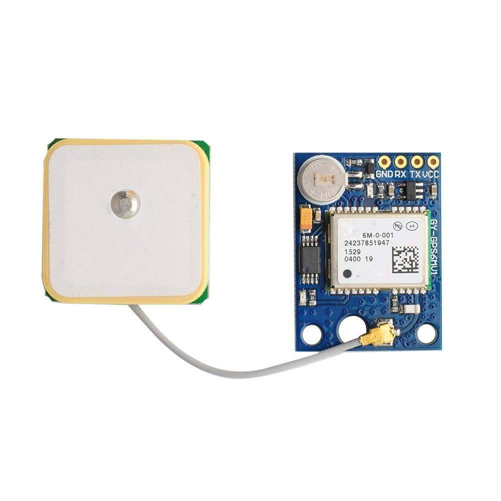
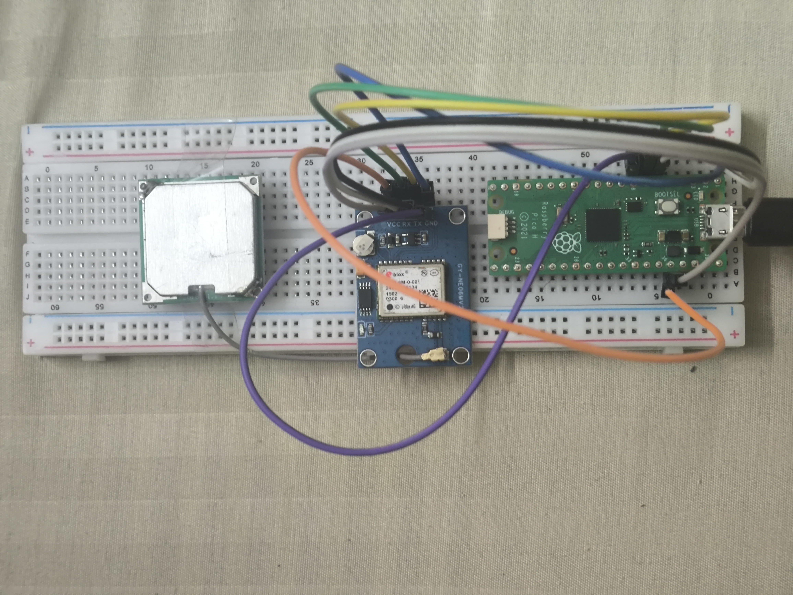

# Pico + Neo M6 GPS + OpenPLC Examples

This repository contains three examples of using a **Raspberry Pi Pico** with a **Neo M6 GPS** module and an external antenna. The code is written for the Arduino IDE and OpenPLC.

---

## Hardware Overview

### Raspberry Pi Pico Pinout


> **Note:** The Pi Pico has multiple UARTs. By default, the examples in this repo use **UART1** on pins **RX=5** and **TX=4**.

### Neo M6 GPS Module



> **Note:** The Neo M6 typically operates at **3.3V**. Check your module’s voltage requirements.
> 
### Neo M6 with pi pico


> **Note:** PICO has micro USB port which has to connect with laptop using USB to micro USB cable.And other setup as per **Wiring Diagram** .
---

## Wiring Diagram

| GPS Module Pin | Pi Pico Pin |
|---------------|------------|
| TX           | RX (Pin 5) |
| RX           | TX (Pin 4) |
| GND          | GND        |
| VCC          | 3.3V       |

---

## 1. Raw Data (1_RawData)

This example reads raw NMEA sentences from the GPS module and prints them to the Serial Monitor.

### Steps to Run:
1. Open **Arduino IDE**.
2. Connect the Raspberry Pi Pico to your computer via USB.
3. Select **Raspberry Pi Pico** as the board.
4. Open the `1_RawData` sketch.
5. Copy the code to Arduino IDE and  **Upload** to flash the code onto the Pico.
6. Open **Serial Monitor** (115200 baud) to view the raw GPS data.

### Expected Output:
```
$GPGGA,123519,4807.038,N,01131.000,E,1,08,0.9,545.4,M,46.9,M,,*47
$GPRMC,123519,A,4807.038,N,01131.000,E,022.4,084.4,230394,003.1,W*6A
```

---

## 2. Parse Data (2_ParseData)

This example extracts latitude and longitude from NMEA sentences and prints them in a readable format.

### Steps to Run:
1. Open **Arduino IDE**.
2. Connect the Raspberry Pi Pico to your computer via USB.
3. Select **Raspberry Pi Pico** as the board.
4. Open the `2_ParseData` sketch.
5. Copy the code to Arduino IDE and  **Upload** to flash the code onto the Pico.
6. Open **Serial Monitor** (9600 baud) to view the parsed GPS data.

### Expected Output:
```
Latitude: 48.1173° N
Longitude: 11.5167° E
Time: 12:35:19 UTC
```

---

## 3. OpenPLC Integration (3_OpenPLC)

This example integrates GPS data into OpenPLC, allowing the Pico to send location data for automation purposes.

### Steps to Run:
1. Install **OpenPLC Editor** on your computer.
2. Connect the Raspberry Pi Pico to your computer via USB.
3. Open **Arduino IDE** and upload the `3_OpenPLC` sketch.
4. Launch OpenPLC Runtime and select the Pico as the target device.
5. Configure OpenPLC to read latitude and longitude as external variables.
6. Run OpenPLC and observe live location data being processed.


---

## License
This project is open-source under the MIT License.

## Contributions
Feel free to fork this repository, add new features, and create pull requests!

---

**Happy coding! 🚀**
